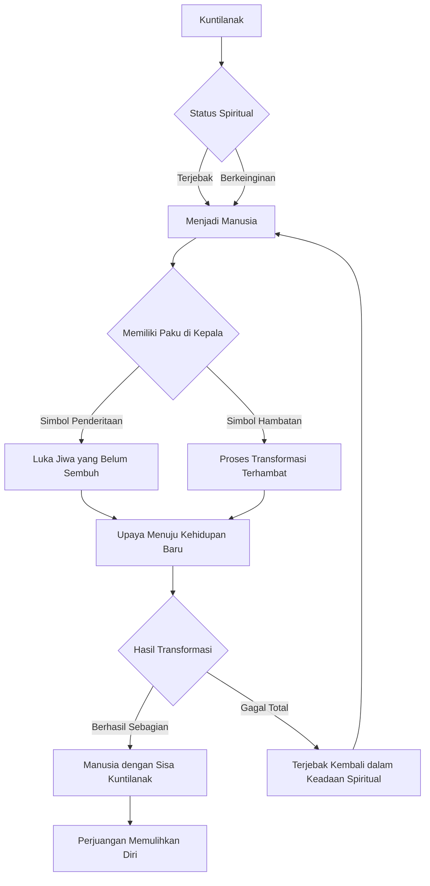

## Daftar Isi

1.  [Pendahuluan: Membuka Tirai Misteri Kuntilanak dan Transformasinya](#pendahuluan)
2.  [Kuntilanak dalam Folklor Indonesia: Lebih dari Sekadar Hantu Penunggu Pohon](#kuntilanak-folklor)
    *   [Asal Usul dan Legenda Kuntilanak](#asal-usul-kuntilanak)
    *   [Karakteristik dan Ciri Khas Kuntilanak](#karakteristik-kuntilanak)
    *   [Hubungan Kuntilanak dengan Kematian dan Tragedi](#hubungan-kuntilanak-kematian)
3.  [Transformasi Kuntilanak Menjadi Manusia: Sebuah Hipotesis dan Interpretasi](#transformasi-manusia)
    *   [Mengapa Kuntilanak Ingin Menjadi Manusia?](#mengapa-transformasi)
    *   [Mekanisme Transformasi: Pintu Keluar dari Keabadian Hantu](#mekanisme-transformasi)
    *   [Studi Kasus Hipotetis: Kisah yang Belum Terungkap](#studi-kasus-hipotetis)
4.  [Paku di Kepala: Simbolisme dan Arti Tersembunyi](#paku-di-kepala)
    *   [Makna Paku dalam Budaya dan Kepercayaan](#makna-paku)
    *   [Paku sebagai Penanda Penderitaan dan Luka Jiwa](#paku-penderitaan)
    *   [Paku sebagai Kunci atau Hambatan Transformasi](#paku-kunci-hambatan)
    *   [Hubungan Simultan Paku dan Transformasi Kuntilanak](#hubungan-simultan)
5.  [Analisis Mendalam: Kuntilanak Menjadi Manusia dengan Paku Tertancap di Kepala](#analisis-mendalam)
    *   [Skenario 1: Kuntilanak yang "Tertolong" dan Terjebak](#skenario-tertolong-terjebak)
    *   [Skenario 2: Kuntilanak yang "Mencoba" dan Gagal](#skenario-mencoba-gagal)
    *   [Skenario 3: Kuntilanak yang "Terusir" dan Berjuang](#skenario-terusir-berjuang)
    *   [Implikasi Psikologis dan Filosofis](#implikasi-psikologis-filosofis)
6.  [Studi Kasus Fiksi dan Refleksi Budaya](#studi-kasus-fiksi)
    *   [Analisis Film, Novel, dan Cerita Rakyat yang Terkait](#analisis-fiksi)
    *   [Bagaimana Kuntilanak dalam Cerita Mempengaruhi Persepsi Kita](#persepsi-budaya)
7.  [Mencari Kebenaran: Keterbatasan dan Potensi Penelitian](#mencari-kebenaran)
    *   [Tantangan Membuktikan Fenomena Supernatural](#tantangan-bukti-supernatural)
    *   [Peran Narasi dan Keyakinan Kolektif](#peran-narasi-keyakinan)
    *   [Pendekatan Ilmiah vs. Pendekatan Budaya](#pendekatan-ilmiah-budaya)
8.  [Penutup: Mengakhiri Jejak Misteri, Membuka Jalan Pemahaman](#penutup)

## Pendahuluan: Membuka Tirai Misteri Kuntilanak dan Transformasinya

Indonesia, sebuah negeri yang kaya akan cerita rakyat, mitos, dan legenda, menyimpan sejuta misteri yang terus memikat imajinasi. Salah satu entitas supernatural yang paling ikonik dan sering dibicarakan adalah Kuntilanak. Sosoknya yang menyeramkan, sering kali digambarkan dengan rambut panjang tergerai, baju putih lusuh, dan suara tangisan yang merindingkan bulu kuduk, telah menjadi bagian tak terpisahkan dari warisan budaya lisan turun-temurun. Namun, di balik citra horornya, tersembunyi berbagai interpretasi dan kemungkinan narasi yang jauh lebih kompleks. Artikel ini akan menyelami salah satu aspek yang paling menarik sekaligus membingungkan dari legenda Kuntilanak: kemungkinannya untuk bertransformasi menjadi manusia, terutama ketika diiringi dengan gambaran ikonik adanya paku yang tertancap di kepalanya.

Fenomena ini, "Kuntilanak menjadi manusia paku masih tertancap di kepala," bukanlah sekadar kisah seram untuk menakut-nakuti anak kecil. Ia mengisyaratkan sebuah dinamika spiritual yang dalam, sebuah perjuangan abadi antara keberadaan sebagai roh dan keinginan untuk kembali ke kehidupan fisik. Paku di kepala, dalam konteks ini, bukan hanya detail visual yang mengerikan, tetapi kemungkinan besar merupakan simbol krusial yang menjelaskan kondisi, hambatan, atau bahkan kunci dari proses transisi yang luar biasa ini.

Dalam eksplorasi ini, kita akan mengupas tuntas berbagai lapisan makna yang terkandung dalam narasi tersebut. Dimulai dari pemahaman mendalam tentang Kuntilanak dalam folklor Indonesia, kita akan beralih ke hipotesis mengenai kemungkinan transformasinya menjadi manusia. Kemudian, fokus utama akan diarahkan pada arti dan simbolisme paku yang tertancap di kepala, serta bagaimana ia berinteraksi dengan proses transformasi tersebut. Melalui analisis mendalam, studi kasus hipotetis, dan refleksi budaya, kita akan mencoba merajut benang merah untuk memahami misteri abadi ini. Tujuannya adalah bukan untuk membuktikan keberadaan supernatural, melainkan untuk mengeksplorasi makna filosofis, psikologis, dan budaya yang terkandung dalam narasi kuno ini, yang terus hidup dan berevolusi dalam kesadaran kolektif masyarakat Indonesia. Bersiaplah untuk sebuah perjalanan yang akan membawa Anda melampaui batas realitas, menembus dimensi misteri, dan merenungkan arti kehidupan, kematian, serta kemungkinan penebusan yang tak terduga.

## Kuntilanak dalam Folklor Indonesia: Lebih dari Sekadar Hantu Penunggu Pohon

Sebelum menyelami misteri transformasinya, penting untuk memahami terlebih dahulu siapa Kuntilanak dalam konteks budaya dan kepercayaan masyarakat Indonesia. Sosok hantu wanita yang terkenal ini memiliki akar yang dalam dan berbagai variasi cerita di berbagai daerah, namun secara umum, Kuntilanak memiliki ciri khas yang telah mengakar kuat dalam imajinasi kolektif.

### Asal Usul dan Legenda Kuntilanak

Secara umum, Kuntilanak diyakini berasal dari arwah wanita yang meninggal secara tidak wajar, terutama saat hamil atau melahirkan. Kematian yang tragis dan tiba-tiba ini dipercaya meninggalkan energi emosional yang kuat—penyesalan, kemarahan, kesedihan, atau ketidakpuasan—yang menjebak roh mereka di alam fana. Konon, arwah ini tidak dapat melanjutkan perjalanannya ke alam baka dan akhirnya menjelma menjadi Kuntilanak.

Di beberapa daerah, ada variasi cerita mengenai asal usul Kuntilanak. Misalnya, di Jawa, ia sering dikaitkan dengan roh wanita yang disiksa atau dibunuh. Di Kalimantan, ada cerita tentang "Pontianak" yang juga memiliki karakteristik serupa, seringkali dikaitkan dengan arwah istri yang meninggal saat melahirkan, dan suaminya yang sangat berduka kemudian mencari cara untuk mengembalikannya ke dunia. Variasi ini menunjukkan betapa kaya dan beragamnya narasi yang menyelimuti sosok Kuntilanak dalam lanskap budaya Indonesia.

Ada juga kepercayaan yang lebih modern, terutama yang dipopulerkan oleh media, yang menggambarkan Kuntilanak sebagai sosok yang haus darah atau arwah janin. Namun, akar folklornya lebih mengarah pada tragedi personal dan ikatan yang belum terputus dengan dunia orang hidup.

### Karakteristik dan Ciri Khas Kuntilanak

Gambaran Kuntilanak yang paling umum adalah seorang wanita dengan ciri-ciri berikut:

*   **Rambut Panjang Tergerai:** Seringkali digambarkan hitam legam dan sangat panjang, menjuntai hingga ke punggung atau bahkan menyentuh tanah. Rambut ini menjadi salah satu elemen paling menakutkan dari penampilannya.
*   **Pakaian Putih Lusuh:** Biasanya mengenakan gaun panjang berwarna putih, yang seringkali terlihat usang, kotor, atau compang-camping, menambah kesan angker.
*   **Wajah yang Menyeramkan:** Terkadang digambarkan memiliki wajah yang cantik namun pucat dan dingin, di lain waktu bisa juga digambarkan dengan wajah yang mengerikan, dengan mata merah menyala, gigi yang tajam, atau bahkan kulit yang mengelupas.
*   **Suara Tangisan yang Khas:** Tangisan Kuntilanak sering menjadi pertanda kehadirannya. Tangisan ini bisa terdengar dekat atau jauh, kadang merdu seperti anak kecil, kadang melengking dan menyeramkan, tergantung pada niat atau suasana hatinya.
*   **Aroma yang Khas:** Kehadirannya sering disertai dengan aroma bunga melati atau kadang bau bangkai, tergantung pada konteks ceritanya.
*   **Kemampuan Berubah Bentuk:** Dalam beberapa cerita, Kuntilanak memiliki kemampuan untuk berubah bentuk, terkadang menjadi wanita cantik untuk memikat korban, terkadang menjadi hewan, atau bahkan menghilang dan muncul kembali di tempat lain.

### Hubungan Kuntilanak dengan Kematian dan Tragedi

Inti dari legenda Kuntilanak adalah keterkaitannya yang erat dengan kematian yang tidak semestinya dan penderitaan yang mendalam. Mereka mewakili "kesalahan" dalam siklus kehidupan dan kematian, entitas yang seharusnya sudah tiada namun tetap menghantui dunia orang hidup.

*   **Penanda Kematian:** Kehadiran Kuntilanak sering dianggap sebagai pertanda buruk atau akan datangnya malapetaka. Ia bergentayangan di tempat-tempat yang dulunya memiliki kaitan dengan tragedi, seperti rumah kosong, pohon besar, atau kuburan.
*   **Pembalasan dan Kemarahan:** Kadang-kadang, Kuntilanak digambarkan bertindak berdasarkan kemarahan atau keinginan untuk membalas dendam atas perlakuan buruk yang mereka alami semasa hidup.
*   **Keterikatan Duniawi:** Keberadaan mereka di alam fana menunjukkan adanya keterikatan kuat dengan dunia yang ditinggalkan, entah itu berupa urusan yang belum selesai, penyesalan mendalam, atau cinta yang belum terbalaskan.

Memahami latar belakang ini sangat penting, karena ia membentuk dasar bagi narasi tentang Kuntilanak yang ingin bertransformasi menjadi manusia, sebuah keinginan yang mungkin timbul dari keinginan untuk mengakhiri penderitaan, menemukan kedamaian, atau menyelesaikan apa yang belum terselesaikan di kehidupan sebelumnya.

## Transformasi Kuntilanak Menjadi Manusia: Sebuah Hipotesis dan Interpretasi

Konsep Kuntilanak yang bertransformasi menjadi manusia adalah salah satu elemen paling menarik dan spekulatif dari legenda ini. Ini bukan sekadar gagasan yang muncul dari imajinasi liar, tetapi sering kali terlahir dari keinginan mendalam akan kedamaian, penebusan, atau kesempatan kedua yang tidak mereka dapatkan di alam fana.

### Mengapa Kuntilanak Ingin Menjadi Manusia?

Keinginan untuk kembali menjadi manusia bagi Kuntilanak bisa dimotivasi oleh berbagai faktor, yang sebagian besar berakar pada penderitaan dan ketidakpuasan mereka sebagai entitas spiritual:

1.  **Mengakhiri Penderitaan Abadi:** Sebagai roh, Kuntilanak sering kali terperangkap dalam siklus penyesalan, kemarahan, atau kesepian yang tak berujung. Kehidupan manusia, meskipun memiliki tantangan, menawarkan potensi untuk mengalami kehangatan, cinta, dan kepenuhan emosional yang mungkin tidak bisa mereka rasakan sebagai hantu.
2.  **Mencari Kedamaian dan Penebusan:** Kematian yang tidak wajar sering kali meninggalkan luka batin yang mendalam. Keinginan untuk menjadi manusia bisa menjadi upaya untuk "memperbaiki" masa lalu, menebus kesalahan yang mungkin mereka rasakan, atau sekadar menemukan kedamaian yang abadi, yang mungkin hanya bisa dicapai melalui kehidupan fisik yang utuh.
3.  **Memenuhi Keinginan yang Belum Terwujud:** Terutama bagi Kuntilanak yang meninggal dalam keadaan hamil atau melahirkan, ada kerinduan mendalam untuk melihat anak tumbuh, merasakan peran seorang ibu yang lengkap, atau menyelesaikan tugas-tugas kehidupan yang terpotong.
4.  **Menghindari Keberadaan yang Mengerikan:** Keberadaan sebagai Kuntilanak sering kali diasosiasikan dengan menakut-nakuti atau bahkan menyakiti orang lain. Mungkin ada Kuntilanak yang merindukan kehidupan yang normal, di mana mereka tidak menjadi sumber ketakutan bagi makhluk hidup.
5.  **Kembali ke Asal:** Pada dasarnya, Kuntilanak dulunya adalah manusia. Keinginan untuk menjadi manusia lagi bisa jadi adalah panggilan naluriah untuk kembali ke keadaan semula, ke jati diri yang hilang.

### Mekanisme Transformasi: Pintu Keluar dari Keabadian Hantu

Bagaimana sebuah roh Kuntilanak bisa kembali menjadi manusia? Ini adalah ranah spekulasi yang kaya akan unsur magis dan mistis dalam folklor. Beberapa kemungkinan mekanisme meliputi:

*   **Ritual atau Upacara Khusus:** Mungkin ada ritual kuno atau mantra tertentu yang, jika dilakukan dengan benar oleh Kuntilanak itu sendiri atau dibantu oleh pihak lain (misalnya, dukun atau orang suci), dapat memfasilitasi transformasi. Ritual ini bisa melibatkan pengorbanan, pembersihan energi negatif, atau bahkan permintaan maaf kepada dunia.
*   **Tindakan Kebaikan yang Luar Biasa:** Kuntilanak yang menunjukkan kebaikan yang tulus dan tanpa pamrih, atau yang melakukan tindakan penebusan yang signifikan, mungkin "diberi" kesempatan untuk kembali menjadi manusia sebagai imbalan.
*   **Ketidaksempurnaan Proses:** Transformasi ini seringkali tidak sempurna. Ini mungkin menjelaskan mengapa Kuntilanak yang menjadi manusia terkadang masih memiliki jejak atau kekuatan dari keberadaan spiritualnya, seperti dalam kasus paku di kepala.
*   **Perubahan Spiritual Alami yang Jarang Terjadi:** Bisa jadi ada siklus atau hukum alam gaib yang memungkinkan roh-roh tertentu, setelah periode waktu yang sangat lama atau setelah mencapai tingkat kesadaran tertentu, untuk "mengendap" kembali ke alam fisik.
*   **Intervensi Ilahi atau Gaib:** Entitas yang lebih tinggi, dewa, atau kekuatan kosmik tertentu mungkin memiliki kemampuan untuk "memperbaiki" jiwa-jiwa yang tersesat dan mengembalikannya ke wujud manusia.

### Studi Kasus Hipotetis: Kisah yang Belum Terungkap

Bayangkan sebuah kisah hipotetis: Seorang wanita bernama Kirana meninggal dunia saat melahirkan anak pertamanya di tengah malam badai. Kemarahannya atas ketidakberdayaan dan kesedihan atas bayinya yang belum sempat ia peluk membuatnya terperangkap sebagai Kuntilanak. Selama berabad-abad, ia gentayangan, menyaksikan dunia berubah, dan merindukan kehangatan pelukan yang tidak pernah ia rasakan.

Suatu hari, ia menemukan sebuah artefak kuno atau bertemu dengan seorang pertapa bijak yang mengajarkan sebuah ritual. Ritual ini membutuhkan pengorbanan berupa melepaskan segala kemarahan dan penyesalan yang ia miliki. Dalam proses ritual yang menyakitkan itu, ia berhasil membebaskan dirinya dari belenggu spiritual. Namun, trauma kematiannya begitu dalam dan meninggalkan "bekas" yang permanen. Saat proses transformasi menuju wujud manusia, sebuah paku, simbol dari penderitaan dan kematiannya yang tiba-tiba dan brutal, tertanam di kepalanya, menjadi pengingat fisik dari masa lalunya yang kelam, namun juga menjadi penanda bahwa ia telah berhasil kembali ke dunia fisik. Ia kini adalah seorang wanita manusia, namun dengan paku yang tertancap di kepalanya, menjadi bukti bisu dari perjalanan spiritualnya yang luar biasa.

Kisah hipotetis ini membuka jalan untuk memahami bagaimana Kuntilanak bisa menjadi manusia, dan bagaimana elemen-elemen seperti paku dapat menjadi bagian integral dari narasi tersebut, bukan hanya sebagai elemen horor, tetapi sebagai simbol yang memiliki makna mendalam.

## Paku di Kepala: Simbolisme dan Arti Tersembunyi

Elemen "paku yang tertancap di kepala" dalam konteks Kuntilanak yang bertransformasi menjadi manusia adalah detail yang sangat kuat dan sarat makna. Jauh dari sekadar menjadi aksesoris horor, paku ini kemungkinan besar memegang kunci untuk memahami kondisi, perjuangan, atau bahkan cacat yang menyertai transformasi tersebut.

### Makna Paku dalam Budaya dan Kepercayaan

Paku, sebagai objek, memiliki berbagai konotasi dalam budaya manusia, baik secara harfiah maupun metaforis:

*   **Alat Penusuk atau Pengikat:** Fungsi utamanya adalah untuk menyatukan atau menembus. Ini bisa melambangkan kekuatan untuk menahan, mengikat, atau bahkan melukai.
*   **Simbol Penderitaan dan Pengorbanan:** Dalam tradisi Kristen, paku adalah simbol utama dari penyaliban Yesus Kristus, melambangkan penderitaan ekstrem, pengorbanan diri, dan penebusan dosa.
*   **Penanda Kepemilikan atau Identitas:** Di masa lalu, paku bisa digunakan untuk menandai kepemilikan atau sebagai bagian dari ritual penamaan.
*   **Simbol Keburukan atau Kekejaman:** Dalam konteks yang lebih gelap, paku bisa diasosiasikan dengan alat penyiksaan atau kekerasan.
*   **Pintu Gerbang atau Kunci:** Dalam beberapa kepercayaan kuno, benda-benda tajam atau logam bisa dianggap memiliki kekuatan magis untuk membuka atau menutup akses ke alam lain.

### Paku sebagai Penanda Penderitaan dan Luka Jiwa

Ketika paku tertancap di kepala Kuntilanak yang bertransformasi, ia secara kuat mengisyaratkan bahwa proses kembali menjadi manusia bukanlah sesuatu yang mulus atau tanpa konsekuensi. Paku tersebut bisa menjadi simbol dari:

*   **Trauma Kematian yang Belum Tersembuhkan:** Kematian Kuntilanak sering kali tragis dan brutal. Paku di kepala dapat mewakili luka fisik dan emosional yang parah akibat kematian tersebut, yang terus membekas bahkan setelah ia kembali ke wujud manusia.
*   **Sisa Penderitaan sebagai Roh:** Selama menjadi Kuntilanak, roh tersebut mungkin telah mengalami bentuk penderitaan tersendiri. Paku bisa menjadi penanda fisik dari rasa sakit, kesepian, atau siksaan yang dialaminya di alam gaib.
*   **Penanda Ketidaksempurnaan Transformasi:** Transformasi dari roh menjadi manusia mungkin tidak berhasil sepenuhnya. Paku bisa menjadi "cacat" atau pengingat visual dari ketidaksempurnaan proses tersebut, bahwa ada sesuatu yang tertinggal atau tidak terpulihkan.
*   **Beban Emosional yang Berat:** Kepala adalah pusat pemikiran dan emosi. Paku yang tertancap di kepala bisa melambangkan beban emosional yang luar biasa, seperti rasa bersalah, penyesalan, atau kemarahan yang terus menghantui jiwa manusia tersebut.

### Paku sebagai Kunci atau Hambatan Transformasi

Menariknya, paku ini juga bisa memiliki makna dualistik, berfungsi baik sebagai hambatan maupun sebagai kunci:

*   **Hambatan Menuju Kehidupan Penuh:** Paku tersebut bisa menjadi penghalang yang mencegah Kuntilanak yang bertransformasi untuk benar-benar "menjadi manusia" sepenuhnya. Ia mungkin masih terikat pada masa lalunya, sulit berinteraksi sosial, atau terus menerus dihantui oleh kenangan buruk, seolah paku itu mengunci jiwanya.
*   **Kunci untuk Penebusan:** Di sisi lain, paku tersebut bisa menjadi pengingat akan apa yang perlu ia atasi. Ia mungkin harus belajar menerima paku itu, bahkan menggunakannya sebagai sumber kekuatan untuk menghadapi masa lalunya. Dalam beberapa interpretasi spiritual, paku yang tertancap bisa menjadi simbol ujian, dan kemampuan untuk bertahan atau mengatasi paku tersebutlah yang akan membawanya pada penebusan sejati.
*   **Penanda Identitas Baru:** Setelah bertransformasi, paku tersebut menjadi bagian dari identitas barunya. Ini adalah cerita bisu tentang siapa dia, dari mana dia berasal, dan apa yang telah ia lalui.

### Hubungan Simultan Paku dan Transformasi Kuntilanak

Ketika kita menggabungkan narasi "Kuntilanak menjadi manusia" dengan "paku masih tertancap di kepala," kita mendapatkan gambaran yang sangat kuat tentang sebuah perjuangan yang belum selesai. Ini bukan cerita tentang reinkarnasi yang mulus atau kelahiran kembali yang sempurna. Sebaliknya, ini adalah kisah tentang:

*   **Perjuangan untuk Kehidupan Kedua yang Cacat:** Seseorang yang telah melewati ambang kematian dan kembali, namun dengan "bekas luka" yang permanen dari penderitaan spiritualnya.
*   **Keseimbangan Antara Dunia Roh dan Dunia Manusia:** Sosok ini berada di persimpangan, memiliki esensi manusia tetapi terbebani oleh pengalaman spiritualnya sebagai Kuntilanak. Paku tersebut menjadi titik temu fisik dari kedua dimensi ini.
*   **Peluang untuk Penyembuhan:** Meskipun mengerikan, paku tersebut juga bisa dilihat sebagai peluang. Ia adalah simbol dari masalah yang harus dipecahkan, luka yang harus disembuhkan, dan masa lalu yang harus dihadapi.

Dengan demikian, paku di kepala bukan sekadar detail horor, melainkan simbol kompleks yang merangkum tema penderitaan, penebusan, hambatan, dan identitas yang terkait dengan transformasi Kuntilanak menjadi manusia. Ia mengajak kita untuk merenungkan bahwa tidak semua akhir adalah akhir, dan tidak semua awal adalah awal yang baru dan bersih.

## Analisis Mendalam: Kuntilanak Menjadi Manusia dengan Paku Tertancap di Kepala

Memahami konsep Kuntilanak yang bertransformasi menjadi manusia dengan paku tertancap di kepala membutuhkan sebuah analisis yang merangkum berbagai kemungkinan interpretasi. Ini bukan sekadar fantasi horor, melainkan sebuah alegori yang dalam tentang penderitaan, perjuangan, dan keinginan untuk penebusan yang tak terpuaskan. Kita dapat memecahnya menjadi beberapa skenario hipotetis untuk menggali makna yang lebih dalam.

### Skenario 1: Kuntilanak yang "Tertolong" dan Terjebak

Dalam skenario ini, Kuntilanak, yang terperangkap dalam penderitaan abadi, menemukan cara (atau dibantu oleh pihak lain) untuk melepaskan diri dari statusnya sebagai roh. Proses ini bisa saja melibatkan ritual magis, permintaan maaf yang tulus, atau bahkan intervensi dari kekuatan yang lebih tinggi. Namun, karena luka batin dan trauma kematian yang begitu dalam, proses transformasi tidak sempurna.

Paku yang tertancap di kepala adalah bukti fisik dari luka tersebut. Ini bisa melambangkan bahwa meskipun ia berhasil kembali ke alam fisik, jiwanya belum sepenuhnya pulih. Ia mungkin terus merasakan sakit, penyesalan, atau bahkan kemarahan yang berasal dari masa lalunya sebagai Kuntilanak. Paku tersebut berfungsi sebagai penanda bahwa ia telah kembali, tetapi ia belum sepenuhnya "bebas" dari masa lalu kelamnya.

Ia mungkin menjalani kehidupan sebagai manusia, namun dengan bayangan Kuntilanak yang selalu mengikutinya. Setiap kali ia merasakan sakit kepala yang tajam, atau merasakan sesuatu yang asing di kepalanya, itu adalah pengingat akan keberadaan Kuntilanak dalam dirinya, dan perjuangan untuk memisahkan diri dari identitas tersebut. Ini adalah kisah tentang seseorang yang diberi kesempatan kedua, namun terbebani oleh bekas luka masa lalu yang tak terhapuskan.

### Skenario 2: Kuntilanak yang "Mencoba" dan Gagal

Di skenario lain, Kuntilanak secara aktif berusaha untuk bertransformasi menjadi manusia karena kerinduan yang mendalam untuk merasakan kehidupan kembali. Ia melakukan berbagai cara, mungkin mencari pengetahuan kuno, bernegosiasi dengan entitas spiritual, atau bahkan melakukan pengorbanan diri. Namun, upaya tersebut hanya berhasil sebagian.

Paku di kepala menjadi simbol dari kegagalan tersebut. Paku ini bisa jadi adalah "alat" yang digunakan oleh kekuatan yang lebih tinggi untuk menahannya di alam fisik, mencegahnya kembali sepenuhnya ke alam roh, atau mencegahnya menjadi manusia yang sepenuhnya normal. Ia mungkin memiliki wujud manusia, tetapi kekuatan atau energi Kuntilanak masih sangat kuat, "terkunci" atau "terikat" oleh paku tersebut.

Dalam kasus ini, paku tersebut bisa menjadi simbol bahwa Kuntilanak telah "melawan takdir" namun tidak berhasil sepenuhnya. Ia kini terjebak dalam keadaan ambigu: bukan lagi Kuntilanak sepenuhnya, namun juga bukan manusia seutuhnya. Ia mungkin memiliki kemampuan supranatural yang tidak terkendali, mengalami rasa sakit fisik yang konstan, dan sulit untuk berintegrasi dengan masyarakat manusia. Ia adalah sosok yang "tergantung" antara dua alam, paku menjadi jangkar yang menahannya di ambang transformasi yang gagal.

### Skenario 3: Kuntilanak yang "Terusir" dan Berjuang

Skenario ketiga menganggap Kuntilanak tersebut "terusir" dari alam rohnya, mungkin karena ia dianggap tidak lagi berguna, terlalu menyebarkan ketakutan, atau karena telah "diputus" dari ikatan spiritualnya. Dalam proses pengusiran ini, sebuah paku ditancapkan di kepalanya sebagai penanda atau hukuman, yang kemudian secara tidak sengaja memicu proses kembali menjadi manusia, meskipun dalam keadaan yang sangat terdesak.

Paku di kepala di sini bisa menjadi simbol dari penolakan atau ketidakmurnian. Kuntilanak tersebut tidak "layak" untuk kembali ke alam roh, tetapi juga tidak sepenuhnya "cocok" untuk menjadi manusia. Paku adalah cacat permanen yang menandai ketidaklayakannya di kedua alam.

Ia akan menjalani kehidupan manusia dengan rasa sakit dan terasing. Paku tersebut bisa saja membuatnya sensitif terhadap hal-hal spiritual, membuatnya melihat atau merasakan kehadiran roh lain, atau bahkan memungkinkannya berkomunikasi dengan alam gaib dengan cara yang tidak terduga. Ia adalah sosok yang terus berjuang untuk menemukan tempatnya di dunia, sambil membawa beban penderitaan masa lalunya dalam bentuk fisik yang mengerikan.

### Implikasi Psikologis dan Filosofis

Terlepas dari skenario mana yang paling mendekati interpretasi, narasi "Kuntilanak menjadi manusia paku masih tertancap di kepala" membawa implikasi psikologis dan filosofis yang mendalam:

*   **Penebusan Melalui Penderitaan:** Simbol paku di kepala sering kali diasosiasikan dengan penderitaan yang harus dilalui untuk mencapai tujuan yang lebih tinggi. Ini mencerminkan pandangan bahwa penebusan atau kemajuan spiritual tidak datang dengan mudah, tetapi melalui rasa sakit dan pengorbanan.
*   **Identitas yang Terpecah:** Sosok ini merepresentasikan individu yang identitasnya terpecah belah. Ia memiliki ingatan dan pengalaman sebagai manusia sebelum menjadi Kuntilanak, pengalaman mengerikan sebagai Kuntilanak, dan kini berjuang untuk menjadi manusia lagi dengan bekas luka dari kedua keadaan tersebut.
*   **Kemanusiaan yang Terluka:** Kemanusiaan itu sendiri bisa diasumsikan sebagai konsep yang rapuh dan sering kali "terluka" oleh pengalaman hidup. Paku di kepala adalah metafora kuat untuk luka batin yang dibawa banyak manusia, baik yang disadari maupun tidak.
*   **Siklus Kehidupan dan Kematian yang Kompleks:** Narasi ini menantang pandangan linear tentang kehidupan, kematian, dan kelahiran kembali. Ia menunjukkan adanya siklus yang lebih kompleks, di mana antara kematian dan kehidupan baru, terdapat masa transisi yang bisa sangat menyakitkan dan meninggalkan jejak permanen.
*   **Harapan dalam Keterbatasan:** Meskipun gambaran paku di kepala sangat mengerikan, keberhasilan transformasi itu sendiri (meskipun tidak sempurna) menawarkan secercah harapan. Ini menunjukkan bahwa bahkan dari keadaan yang paling mengerikan, ada kemungkinan untuk kembali, untuk mencari kedamaian, atau untuk menjalani kehidupan yang berbeda.

Analisis mendalam ini menunjukkan bahwa Kuntilanak yang menjadi manusia dengan paku di kepala adalah sebuah arketipe yang kaya, mewakili perjuangan universal untuk mengatasi trauma, mencari kedamaian, dan menemukan identitas di tengah kerumitan eksistensi.

## Studi Kasus Fiksi dan Refleksi Budaya

Legenda Kuntilanak yang bertransformasi menjadi manusia, terutama dengan elemen ikonik seperti paku di kepala, bukanlah sekadar kisah lisan yang terisolasi. Ia telah meresap ke dalam berbagai bentuk media fiksi dan terus diperkaya oleh imajinasi kolektif, yang pada gilirannya juga memengaruhi persepsi budaya kita.

### Analisis Film, Novel, dan Cerita Rakyat yang Terkait

Meskipun tidak banyak film atau novel yang secara eksplisit menggambarkan narasi "Kuntilanak menjadi manusia paku masih tertancap di kepala" sebagai plot utama, elemen-elemennya sering kali tersirat atau diadaptasi dalam berbagai karya fiksi Indonesia maupun Asia Tenggara.

*   **Film Horor Indonesia:** Sebagian besar film horor Indonesia yang menampilkan Kuntilanak cenderung berfokus pada aspek penampakan dan teror. Namun, ada beberapa film yang mengeksplorasi latar belakang Kuntilanak sebagai wanita yang meninggal tragis, seringkali saat melahirkan. Film-film seperti "Kuntilanak" (seri), "Rumah Madu" (2010), atau "Munafik" (Malaysia, yang menampilkan hantu wanita yang terikat pada tragedi) sering kali menyentuh tema penyesalan dan ikatan duniawi yang kuat dari hantu tersebut. Jika ada elemen transformasi, biasanya itu adalah upaya Kuntilanak untuk "kembali" dalam bentuk yang lebih menyeramkan atau untuk membalas dendam, bukan menjadi manusia yang utuh. Namun, konsep "terjebak" antara alam roh dan alam manusia seringkali tersirat.

*   **Novel dan Cerita Pendek:** Dalam ranah sastra, penulis seringkali memiliki kebebasan yang lebih besar untuk mengembangkan mitos. Beberapa novel horor atau fantasi mungkin mengeksplorasi kisah Kuntilanak yang berusaha "memulihkan" identitas manusianya. Konsep paku di kepala bisa diinterpretasikan sebagai bekas luka fisik atau psikologis dari tragedi yang ia alami, yang menjadi kunci atau hambatan dalam proses pemulihannya. Misalnya, cerita tentang hantu yang harus menyelesaikan urusannya di dunia agar bisa beristirahat, atau mencari reinkarnasi yang lebih baik.

*   **Cerita Rakyat Tradisional:** Di luar media modern, akar cerita rakyatlah yang paling kaya. Beberapa cerita rakyat lokal mungkin memiliki varian yang lebih detail mengenai transformasi roh gentayangan. Di beberapa tradisi, ada kepercayaan tentang roh yang gentayangan dan berusaha "melalui" siklus penderitaan untuk mencapai kedamaian, yang terkadang diwujudkan dalam bentuk-bentuk fisik yang unik, termasuk paku atau objek lain yang melambangkan penderitaan mereka. Cerita-cerita ini sering kali disampaikan secara lisan dan dapat bervariasi dari satu daerah ke daerah lain.

### Bagaimana Kuntilanak dalam Cerita Mempengaruhi Persepsi Kita

Keberadaan Kuntilanak dalam fiksi dan budaya memiliki dampak yang signifikan terhadap cara kita memandang fenomena supernatural, kematian, dan bahkan kemanusiaan itu sendiri.

*   **Misteri Kematian:** Kuntilanak, dengan latar belakang kematian tragisnya, merepresentasikan ketakutan universal kita terhadap kematian yang tidak wajar dan apa yang terjadi setelahnya. Ia adalah perwujudan dari pertanyaan-pertanyaan yang belum terjawab tentang alam baka.
*   **Kekuatan Emosi yang Belum Selesai:** Cerita Kuntilanak seringkali menekankan kekuatan emosi negatif—kemarahan, penyesalan, kesedihan—yang dapat menjebak jiwa. Ini mengajarkan kita tentang pentingnya mengelola emosi dan menyelesaikan urusan batin agar tidak terjebak.
*   **Konsep Penebusan dan Kesempatan Kedua:** Ketika Kuntilanak digambarkan ingin menjadi manusia atau mencari kedamaian, itu mencerminkan keinginan manusia akan penebusan dan kesempatan kedua. Ini memberikan harapan bahwa bahkan setelah kesalahan besar atau tragedi, ada kemungkinan untuk perubahan atau pemulihan.
*   **Peran Simbolisme dalam Budaya:** Penggunaan simbol-simbol seperti paku di kepala menunjukkan bagaimana budaya kita menggunakan metafora untuk menjelaskan konsep-konsep yang abstrak dan sulit dipahami. Paku tersebut menjadi jembatan antara dunia yang bisa kita lihat dan dunia spiritual yang penuh misteri.
*   **Evolusi Mitos:** Mitos Kuntilanak terus berevolusi. Jika dulu ia lebih sering digambarkan sebagai roh jahat murni, kini banyak cerita yang mencoba menggali sisi manusianya, kompleksitas emosinya, dan bahkan keinginan untuk kembali ke keadaan semula. Hal ini mencerminkan pergeseran dalam cara kita memandang "hal-hal gaib"—tidak lagi sekadar hitam-putih, tetapi lebih bernuansa.

Melalui analisis studi kasus fiksi dan refleksi budaya, kita dapat melihat bahwa narasi "Kuntilanak menjadi manusia paku masih tertancap di kepala" bukanlah sekadar cerita horor usang. Ia adalah sebuah mitos yang hidup, terus beradaptasi, dan berfungsi sebagai cermin bagi kekhawatiran, harapan, dan pemahaman kita tentang kehidupan, kematian, dan potensi transformatif dari pengalaman manusia yang terdalam.

## Mencari Kebenaran: Keterbatasan dan Potensi Penelitian

Pertanyaan tentang kebenaran di balik fenomena seperti Kuntilanak yang menjadi manusia dengan paku tertancap di kepala adalah sebuah perjalanan yang sarat dengan tantangan epistemologis. Mengingat sifatnya yang berada di ranah supernatural, sulit untuk menerapkan metode penelitian ilmiah konvensional. Namun, bukan berarti kita tidak dapat mengeksplorasi aspek-aspek terkait atau memahami bagaimana narasi ini bertahan dan berkembang.

### Tantangan Membuktikan Fenomena Supernatural

1.  **Sifat yang Tidak Terverifikasi:** Fenomena supernatural, secara definisi, berada di luar jangkauan pengujian empiris yang dapat diulang dan diverifikasi oleh standar sains modern. Keberadaan Kuntilanak, apalagi transformasinya menjadi manusia, belum pernah terbukti secara ilmiah.
2.  **Ketergantungan pada Kesaksian Subjektif:** Sebagian besar cerita tentang Kuntilanak dan fenomena serupa bergantung pada kesaksian pribadi, pengalaman spiritual, atau cerita dari mulut ke mulut. Kesaksian ini seringkali dipengaruhi oleh kepercayaan pribadi, sugesti, emosi, dan interpretasi subjektif, yang membuatnya sulit untuk dijadikan bukti objektif.
3.  **Kurangnya Bukti Fisik yang Konklusif:** Meskipun ada cerita tentang paku di kepala, tidak ada bukti fisik yang dapat dianalisis secara ilmiah untuk memvalidasi keberadaan paku tersebut pada entitas seperti Kuntilanak, apalagi yang berhubungan dengan transformasi menjadi manusia.
4.  **Distingsi antara Mitos dan Realitas:** Seiring berjalannya waktu, batas antara mitos yang diciptakan untuk tujuan naratif (misalnya, dalam cerita horor) dan klaim tentang realitas menjadi kabur. Seringkali, detail-detail mengerikan seperti paku di kepala lebih berfungsi sebagai elemen dramatis daripada deskripsi faktual.

### Peran Narasi dan Keyakinan Kolektif

Meskipun pembuktian ilmiah sulit, keberadaan dan vitalitas narasi tentang Kuntilanak yang bertransformasi tidak bisa diabaikan. Ini menunjukkan kekuatan besar dari narasi dan keyakinan kolektif:

*   **Membangun Identitas Budaya:** Mitos dan legenda, termasuk Kuntilanak, memainkan peran penting dalam membentuk identitas budaya suatu masyarakat. Mereka mewakili nilai-nilai, ketakutan, harapan, dan pandangan dunia bersama.
*   **Mekanisme Penjelasan Dunia:** Dalam masyarakat yang lebih tradisional, cerita-cerita supernatural sering digunakan sebagai cara untuk menjelaskan fenomena yang tidak dapat dipahami, seperti kematian mendadak, penyakit, atau kejadian alam yang mengerikan.
*   **Validasi Pengalaman Emosional:** Cerita Kuntilanak yang bertransformasi, dengan tema penderitaan dan penebusan, dapat memberikan validasi emosional bagi individu yang mengalami kesulitan atau trauma dalam hidup mereka. Kisah-kisah ini menawarkan resonansi pada pengalaman manusia yang universal.
*   **Perpetuasi Melalui Cerita Lisan dan Media:** Melalui cerita dari mulut ke mulut, sastra, film, dan internet, mitos Kuntilanak terus diperbaharui dan disebarkan, memastikan keberadaannya dalam kesadaran kolektif.

### Pendekatan Ilmiah vs. Pendekatan Budaya

Meskipun sains mungkin tidak dapat "membuktikan" Kuntilanak menjadi manusia, kita dapat menggunakan pendekatan lain untuk memahami fenomena ini:

*   **Antropologi dan Sosiologi:** Para antropolog dan sosiolog dapat mempelajari mitos Kuntilanak sebagai fenomena budaya. Mereka dapat menganalisis asal-usul cerita, variasi regionalnya, fungsi sosialnya, dan bagaimana cerita tersebut mencerminkan nilai-nilai masyarakat.
*   **Studi Sastra dan Budaya:** Analisis sastra dapat mengupas makna simbolis dari elemen-elemen dalam cerita Kuntilanak, seperti paku di kepala. Ini membantu kita memahami bagaimana mitos ini digunakan untuk menyampaikan pesan-pesan filosofis, psikologis, atau moral.
*   **Psikologi Lintas Budaya:** Mempelajari bagaimana kepercayaan terhadap entitas supernatural seperti Kuntilanak memengaruhi perilaku dan persepsi individu dalam budaya tertentu. Ini dapat memberikan wawasan tentang bagaimana keyakinan membentuk pengalaman manusia.
*   **Studi Sejarah Kepercayaan:** Menelusuri akar kepercayaan terhadap roh gentayangan dan transformasi dalam sejarah berbagai peradaban dapat memberikan konteks yang lebih luas untuk memahami mitos Kuntilanak.

Pada akhirnya, "kebenaran" di balik Kuntilanak yang menjadi manusia dengan paku tertancap di kepala mungkin terletak bukan pada bukti empiris, melainkan pada makna yang ia miliki bagi budaya yang menciptakannya dan terus menghidupkannya. Ia adalah sebuah alegori, sebuah cerminan dari aspek-aspek terdalam kemanusiaan—penderitaan, harapan, ketakutan, dan keinginan abadi untuk penebusan. Penelitian terhadap mitos semacam ini lebih kepada memahami manusia di balik mitos tersebut, daripada membuktikan keberadaan mitos itu sendiri.

## Penutup: Mengakhiri Jejak Misteri, Membuka Jalan Pemahaman

Perjalanan kita dalam mengupas misteri "Kuntilanak menjadi manusia paku masih tertancap di kepala" telah membawa kita melampaui batas-batas nalar konvensional, merambah ke dalam relung-relung folklor, simbolisme, dan pemahaman budaya. Kita telah menyaksikan bagaimana sosok Kuntilanak, yang sering kali hanya dianggap sebagai cerita seram, menyimpan kekayaan narasi yang luar biasa tentang penderitaan, keinginan, dan perjuangan spiritual.

Konsep transformasi Kuntilanak menjadi manusia, meski terdengar fantastis, membuka jendela untuk merenungkan keinginan terdalam manusia akan kedamaian, penebusan, dan kesempatan kedua. Ini adalah refleksi dari upaya untuk mengatasi trauma, memperbaiki kesalahan, dan kembali menemukan jati diri yang hilang. Paku yang tertancap di kepala, dalam konteks ini, bukanlah sekadar elemen horor visual yang brutal, melainkan sebuah simbol yang kaya makna. Ia mewakili luka yang belum sembuh dari kematian yang tragis, beban penderitaan yang terus menghantui, atau bahkan cacat permanen dari proses transformasi yang tidak sempurna. Paku tersebut menjadi penanda kesatuan antara esensi Kuntilanak yang tersiksa dan aspirasi manusianya yang baru lahir.

Analisis mendalam terhadap berbagai skenario—mulai dari Kuntilanak yang "tertolong" namun terjebak, Kuntilanak yang "mencoba" namun gagal, hingga Kuntilanak yang "terusir" dan berjuang—menggarisbawahi kompleksitas pengalaman transisi spiritual. Ia menunjukkan bahwa jalan menuju pemulihan atau penebusan seringkali tidak mulus, melainkan penuh liku, dan meninggalkan bekas luka yang mendalam, baik secara fisik maupun metaforis.

Studi kasus fiksi dan refleksi budaya menggarisbawahi bagaimana mitos ini terus hidup dan beradaptasi, merespons ketakutan, harapan, dan nilai-nilai kolektif masyarakat. Kuntilanak dalam cerita menjadi cermin bagi cara kita memandang kematian, emosi yang belum selesai, dan aspirasi universal untuk menemukan makna dan kedamaian.

Meskipun secara ilmiah sulit untuk "membuktikan" kebenaran fenomena ini, eksplorasi terhadap narasi Kuntilanak yang bertransformasi memberikan wawasan berharga. Pendekatan antropologis, sosiologis, dan studi budaya memungkinkan kita untuk memahami fungsi mitos ini dalam masyarakat, makna simbolis yang dikandungnya, dan bagaimana ia membentuk persepsi kita tentang kehidupan, kematian, dan kemanusiaan itu sendiri.

Pada akhirnya, misteri Kuntilanak yang menjadi manusia dengan paku tertancap di kepala mengajak kita untuk melihat melampaui kengerian permukaan. Ia mengajak kita untuk merenungkan tentang sifat penderitaan yang abadi, kekuatan harapan yang tak padam, dan proses penebusan yang seringkali terjalin erat dengan rasa sakit. Kisah ini mengajarkan kita bahwa transformasi, betapapun mengerikannya, adalah bagian dari siklus kehidupan yang lebih besar, dan bahwa bahkan dari kegelapan yang paling pekat, mungkin ada secercah cahaya, sebuah kesempatan untuk kembali, meski dengan luka yang membekas sebagai pengingat abadi. Mari kita akhiri jejak misteri ini bukan dengan penutupan, melainkan dengan membuka jalan bagi pemahaman yang lebih dalam tentang kekuatan narasi dan kedalaman jiwa manusia yang abadi.
